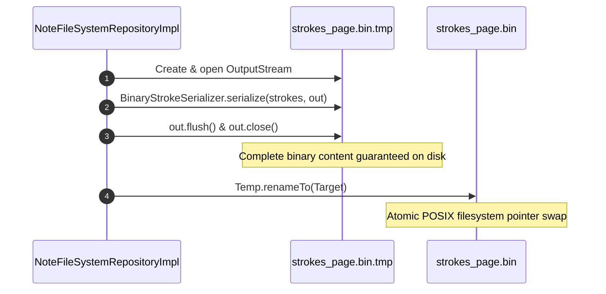

# Note File System Repository & Sandboxed Storage

- **File Path**: [`app/src/main/kotlin/com/mal5odha/core/data/repository/NoteFileSystemRepositoryImpl.kt`](file:///d:/projects/mobile_projects/Notes/notes_app_native_android/app/src/main/kotlin/com/mal5odha/core/data/repository/NoteFileSystemRepositoryImpl.kt#L17-L191)
- **Interface**: [`app/src/main/kotlin/com/mal5odha/core/data/repository/NoteFileSystemRepository.kt`](file:///d:/projects/mobile_projects/Notes/notes_app_native_android/app/src/main/kotlin/com/mal5odha/core/data/repository/NoteFileSystemRepository.kt#L1-L40)
- **Subsystem**: Data Persistence & Storage
- **Primary Class**: `com.mal5odha.core.data.repository.NoteFileSystemRepositoryImpl`

---

## 1. Directory Structure on Internal Sandboxed Storage

All document page hierarchies, binary strokes, and thumbnail assets reside within the application's sandboxed private storage (`context.filesDir`):

```
/data/user/0/com.mal5odha.app/files/
└── notes/
    └── {documentId}/
        ├── pages.json             # Page order, background metadata, timestamps
        ├── strokes_{pageId_0}.bin # Vector strokes for Page 0 (Binary format)
        ├── strokes_{pageId_1}.bin # Vector strokes for Page 1
        ├── text_{pageId_0}.json   # Text annotations (JSON)
        ├── media_{pageId_0}.json  # Image/media attachments (JSON)
        └── cover.jpg              # High-density rendered thumbnail
```

This layout guarantees:
- **No storage permissions required**: Completely sandboxed from Android 11+ Scoped Storage restrictions.
- **Independent page streaming**: The editor only reads `strokes_{activePageId}.bin` into memory, keeping heap consumption bounded regardless of total document page count.

---

## 2. Atomic Writes with Crash Resilience

In mobile handwriting, sudden power outages, process kills by the Android Low Memory Killer (LMK), or battery exhaustion during a write operation can cause catastrophic file corruption (zero-byte files).

To prevent corruption, `NoteFileSystemRepositoryImpl` enforces an **atomic write-and-rename pattern**:



```kotlin
// NoteFileSystemRepositoryImpl.kt:56-66
val noteDir = getNoteDir(documentId)
val binFile = File(noteDir, "strokes_$pageId.bin")
val tempFile = File(noteDir, "strokes_$pageId.bin.tmp")

tempFile.outputStream().use { out ->
    BinaryStrokeSerializer.serialize(strokes, out)
}
tempFile.renameTo(binFile) // Atomic filesystem operation
```

If the process is killed halfway through serialization, the old `strokes_page.bin` remains uncorrupted, and the incomplete `.tmp` file is cleaned up on the next startup.

---

## 3. Dependency Injection & Threading

`NoteFileSystemRepositoryImpl` is bound as a `@Singleton` in Dagger Hilt:
- Every I/O method runs within `withContext(Dispatchers.IO)`.
- Reuses a shared `Gson` instance for metadata JSON serialization.
- Provides `deleteNote(documentId)` for full recursive directory purging upon permanent deletion.
