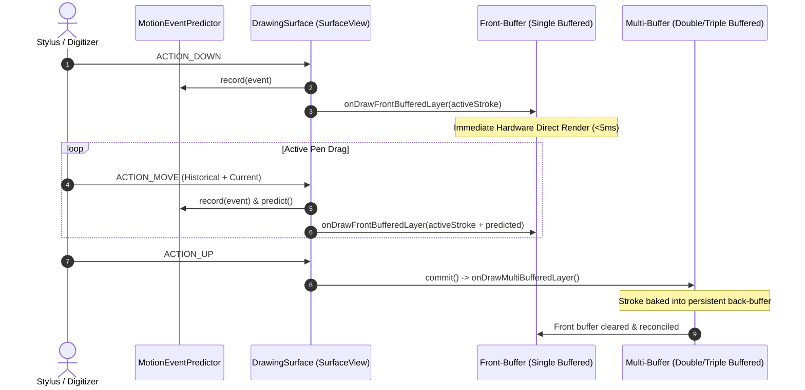

# DrawingSurface & Low-Latency Rendering Engine

- **File Path**: [`app/src/main/kotlin/com/mal5odha/core/ink/ui/DrawingSurface.kt`](file:///d:/projects/mobile_projects/Notes/notes_app_native_android/app/src/main/kotlin/com/mal5odha/core/ink/ui/DrawingSurface.kt#L42-L695)
- **Subsystem**: Digital Inking Engine
- **Primary Class**: `com.mal5odha.core.ink.ui.DrawingSurface`

---

## 1. Architectural Role & Problem Statement

In Android stylus handwriting applications, input latency exceeding $16\text{ ms}$ breaks the illusion of physical ink touching glass, causing severe cognitive friction for users. Standard Android view hierarchies and Jetpack Compose composable canvases introduce layout passes, measure passes, and thread hops to `RenderThread` that induce unpredictable frame-time variance (jitter) and missed $120\text{ Hz}$ display deadlines.

`DrawingSurface` resolves this by bypassing the standard `ViewRootImpl` compositing pipeline. It couples an Android native `SurfaceView` with `CanvasFrontBufferedRenderer` (from `androidx.graphics:graphics-core`) and AndroidX `MotionEventPredictor`, achieving sub-$10\text{ ms}$ touch-to-glass rendering latency on supported hardware (such as Samsung S-Pen and standard active digitizers).

---

## 2. Front-Buffered vs. Multi-Buffered Dual Rendering Architecture

The rendering engine operates on a dual-tier buffering model defined in [`DrawingSurface.kt:42-44`](file:///d:/projects/mobile_projects/Notes/notes_app_native_android/app/src/main/kotlin/com/mal5odha/core/ink/ui/DrawingSurface.kt#L42-L44):



### 2.1 Low-Latency Front Buffer (`onDrawFrontBufferedLayer`)
While the stylus is actively drawing on screen:
1. Touch coordinates are sampled from `MotionEvent`.
2. Historical batches via `event.getHistoricalX()` and predicted points from `MotionEventPredictor` are appended to the active stroke.
3. The renderer paints directly into the display's front buffer, bypassing compositor wait queues.
4. Transient ink is rendered with high precision using `CatmullRomInterpolator.createSmoothPath(...)`.

### 2.2 Committing to Multi-Buffer (`onDrawMultiBufferedLayer`)
When the stylus lifts (`MotionEvent.ACTION_UP`):
1. `frontBufferRenderer.commit()` is called.
2. The front buffer is cleared, and the completed stroke is handed off to the multi-buffered swapchain.
3. The stroke is permanently retained in the document stroke collection and indexed into the `QuadTree` spatial index.

---

## 3. Normalized Page Coordinate Space & Active Page Isolation

To maintain resolution independence across diverse tablet screens, phone displays, zoom factors, and PDF exports, `DrawingSurface` translates all coordinates to normalized page units:

$$\begin{aligned}
x_{\text{page}} &= \frac{x_{\text{screen}} - \text{pageBounds.left}}{\text{pageBounds.width}} \\
y_{\text{page}} &= \frac{y_{\text{screen}} - \text{pageBounds.top}}{\text{pageBounds.height}}
\end{aligned}$$

### 3.1 Strict Active Page Boundary Isolation
Touches initiating outside `activePageBounds` are immediately rejected:

```kotlin
// DrawingSurface.kt:34-37
// Touches initiating outside the target page boundary are rejected.
if (!activePageBounds.contains(event.x, event.y)) {
    return false // Reject touch to avoid bleed into adjacent multi-page margins
}
```

This guarantees that:
- In multi-page horizontal or vertical carousel layouts, stylus ink from page $N$ never spills over page margins into page $N+1$.
- Multi-finger pan and pinch gestures outside the canvas seamlessly pass through to the outer viewport scrolling containers.

---

## 4. Palm Rejection & Tool Dispatching

`DrawingSurface` inspects `MotionEvent.getToolType(pointerIndex)`:
- `TOOL_TYPE_STYLUS` / `TOOL_TYPE_ERASER`: Dedicated ink pathways. Palm rejection is enforced; finger touches occurring simultaneously with stylus proximity are ignored.
- `TOOL_TYPE_FINGER`: If stylus-only mode is enabled, finger inputs only trigger multi-touch viewport pan/zoom via `ScaleGestureDetector`.

---

## 5. Lifecycle Management & Resource Disposal

When navigating away from the note editor, `SurfaceView` buffers can bleed or retain stale frames if not explicitly destroyed. `DrawingSurface` defines explicit teardown semantics:

```kotlin
fun destroy() {
    frontBufferRenderer?.release()
    frontBufferRenderer = null
    predictor = null
    visibility = View.GONE
}
```

Releasing the renderer unbinds the hardware `SurfaceControl` handles, ensuring zero memory leaks and clean transitions back to Jetpack Compose navigation destinations.
