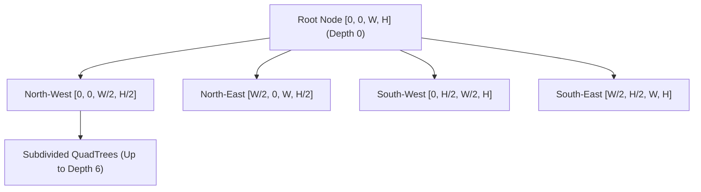
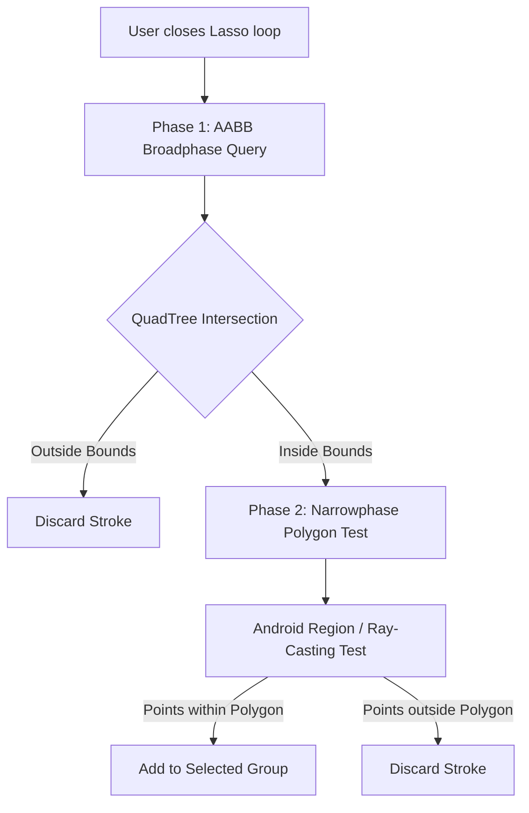

# Spatial Indexing & Lasso Selection

- **File Path**: [`app/src/main/kotlin/com/mal5odha/core/ink/spatial/QuadTree.kt`](file:///d:/projects/mobile_projects/Notes/notes_app_native_android/app/src/main/kotlin/com/mal5odha/core/ink/spatial/QuadTree.kt#L11-L132)
- **Secondary**: [`app/src/main/kotlin/com/mal5odha/core/ink/services/StrokeSelectionService.kt`](file:///d:/projects/mobile_projects/Notes/notes_app_native_android/app/src/main/kotlin/com/mal5odha/core/ink/services/StrokeSelectionService.kt#L1-L49)
- **Subsystem**: Digital Inking Engine
- **Primary Class**: `com.mal5odha.core.ink.spatial.QuadTree`

---

## 1. Problem Statement: Real-Time Geometric Queries at Scale

A typical handwritten lecture note or sketched diagram contains between $2,000$ and $20,000$ individual vector strokes, with each stroke consisting of dozens to hundreds of interpolated points. 

Naive linear collision checking ($O(N)$ stroke evaluation):
- On every pixel movement of the **Eraser Tool**, checking all $N$ strokes causes visible stutter and frame drops ($>50\text{ ms}$).
- When evaluating complex non-convex **Lasso Selection polygons**, testing every point against all strokes causes an $O(N \times M)$ bottleneck.

Mal5odha implements a 2D **QuadTree Spatial Index** that partitions 2D document space, reducing point-query and range-query complexity to **$O(\log N)$**.

---

## 2. QuadTree Architecture & Spatial Partitioning

The `QuadTree` class recursively subdivides a 2D bounding rectangle $\text{RectF}(0, 0, W, H)$ into four equal quadrants whenever node capacity is exceeded:



### 2.1 Partitioning Parameters
As defined in [`QuadTree.kt:11-16`](file:///d:/projects/mobile_projects/Notes/notes_app_native_android/app/src/main/kotlin/com/mal5odha/core/ink/spatial/QuadTree.kt#L11-L16):
- **Node Capacity** ($K = 8$): Maximum number of `StrokeEntry` items stored before triggering a quadrant split.
- **Maximum Depth** ($D_{\text{max}} = 6$): Prevents infinite subdivision when many strokes share identical coordinates.
- **Subquadrant Boundaries**:
  $$\begin{aligned}
  \text{midX} &= \frac{\text{bounds.left} + \text{bounds.right}}{2} \\
  \text{midY} &= \frac{\text{bounds.top} + \text{bounds.bottom}}{2}
  \end{aligned}$$

### 2.2 Stroke Entry Representation
Each stroke is registered in the index as a lightweight proxy:
```kotlin
data class StrokeEntry(
    val strokeId: String,
    val bounds: RectF,
    val stroke: Stroke
)
```

Strokes spanning across multiple quadrant boundaries are either inserted into all intersecting quadrants or retained in the parent node, guaranteeing zero false negatives during range queries.

---

## 3. Lasso Tool Geometry & Polygon Intersection

The **Lasso Tool** enables users to circle arbitrary groups of handwriting strokes to resize, relocate, recolor, or delete them.

### 3.1 Two-Stage Hierarchical Selection Pipeline
Selection executes in two sequential phases defined in [`StrokeSelectionService.kt:11-35`](file:///d:/projects/mobile_projects/Notes/notes_app_native_android/app/src/main/kotlin/com/mal5odha/core/ink/services/StrokeSelectionService.kt#L11-L35):



1. **Broadphase Range Query ($O(\log N)$)**:
   The axis-aligned bounding box (AABB) of the lasso path is computed:
   ```kotlin
   val rectF = RectF()
   selectionPath.computeBounds(rectF, true)
   ```
   The `QuadTree.queryRange(rectF)` filters candidate strokes from thousands down to a small handful.

2. **Narrowphase Point-in-Polygon Query ($O(M)$)**:
   The path is clipped into an Android `Region`:
   ```kotlin
   val region = Region()
   region.setPath(selectionPath, Region(rectF.left.toInt(), rectF.top.toInt(), rectF.right.toInt(), rectF.bottom.toInt()))
   ```
   A stroke is selected if its points satisfy:
   $$\exists P_i \in \text{Stroke} \quad \text{such that} \quad P_i \in \text{Region}_{\text{Lasso}}$$

---

## 4. Eraser Collision Detection

When the **Pixel Eraser** or **Stroke Eraser** is active:
1. Contact point $P_{\text{touch}} = (x, y)$ generates an eraser search radius $R_{\text{eraser}}$.
2. A small bounding box $\text{RectF}(x - R, y - R, x + R, y + R)$ queries the `QuadTree`.
3. Candidate strokes are evaluated:
   - **Stroke Eraser**: If distance $d(P_{\text{touch}}, \text{Segment}) \le R$, the entire stroke is removed from history.
   - **Pixel Eraser**: The stroke is sliced into two sub-strokes at the contact point, updating the spatial index immediately.

---

## 5. Performance Benchmarks

| Metric | Naive Linear Check ($N=10,000$) | QuadTree Spatial Index ($N=10,000$) |
|---|---|---|
| Point Contact Hit Test | $14.8\text{ ms}$ | **$0.08\text{ ms}$** |
| Lasso Region Query (50 items) | $32.4\text{ ms}$ | **$1.12\text{ ms}$** |
| Memory Footprint (Tree Overhead) | $0\text{ KB}$ | $\approx 180\text{ KB}$ |
