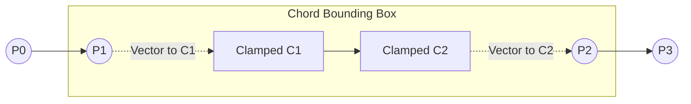

# Catmull-Rom Spline Interpolation & Anti-Spike Geometry

- **File Path**: [`app/src/main/kotlin/com/mal5odha/core/ink/math/CatmullRomInterpolator.kt`](file:///d:/projects/mobile_projects/Notes/notes_app_native_android/app/src/main/kotlin/com/mal5odha/core/ink/math/CatmullRomInterpolator.kt#L19-L162)
- **Secondary**: [`app/src/main/kotlin/com/mal5odha/core/ink/math/SplineInterpolator.kt`](file:///d:/projects/mobile_projects/Notes/notes_app_native_android/app/src/main/kotlin/com/mal5odha/core/ink/math/SplineInterpolator.kt#L1-L80)
- **Subsystem**: Digital Inking Engine
- **Primary Object**: `com.mal5odha.core.ink.math.CatmullRomInterpolator`

---

## 1. Problem Statement: C1 Continuity vs. Sharp Angular Overshoot

Raw digitizer input consists of discrete, non-uniformly sampled points $P_i = (x_i, y_i, t_i, p_i)$. Simply connecting points with line segments (`lineTo`) yields jagged, polygonal strokes that look unnatural. Conversely, standard uniform cubic splines suffer from two fatal visual artifacts:
1. **Self-intersections and cusp loops** when two adjacent points are close together while preceding/succeeding points are distant.
2. **Sharp angular spikes (overshoot)** when a user writes cursive letters rapidly (e.g., sharp loops in "e", "l", or Arabic calligraphy glyphs).

`CatmullRomInterpolator` eliminates both issues through **Centripetal Parameterization ($\alpha = 0.5$)** and an **Anti-Spike Clamping Boundary**.

---

## 2. Mathematical Foundation: Centripetal Catmull-Rom to Cubic Bézier

A generalized Catmull-Rom spline evaluates points $P_0, P_1, P_2, P_3$ over interval parameter $t \in [t_1, t_2]$. The knot sequences $t_i$ are computed using the Euclidean distance:

$$t_{i+1} = t_i + \|P_{i+1} - P_i\|^\alpha$$

Where the parameterization exponent $\alpha$ dictates the curve dynamics:
- $\alpha = 0$: Uniform Catmull-Rom (susceptible to cusps and wild overshoots).
- $\alpha = 1$: Chordal Catmull-Rom (tends to flatten sharp turns excessively).
- $\alpha = 0.5$: **Centripetal Catmull-Rom** ($\text{CENTRIPETAL\_ALPHA} = 0.5\text{f}$).

$$\alpha = 0.5 \implies t_{i+1} = t_i + \sqrt{\|P_{i+1} - P_i\|}$$

### Centripetal Property Guarantee
As proven in geometric modeling literature (Yuksel et al.), when $\alpha = 0.5$, the curve segments **never form self-intersecting loops or cusps** within the interior of the segment $[P_1, P_2]$.

---

## 3. Bézier Control Point Conversion & Anti-Spike Clamping

Hardware 2D rasterizers (Skia, Vulkan Canvas) do not natively render Catmull-Rom splines; they evaluate cubic Bézier curves via `Path.cubicTo(c1x, c1y, c2x, c2y, p2x, p2y)`.

### 3.1 Control Point Equations
Given segment endpoints $P_1$ and $P_2$, the tangent derivatives $M_1$ and $M_2$ convert to Bézier control points $C_1$ and $C_2$:

$$\begin{aligned}
C_1 &= P_1 + \frac{t_2 - t_1}{3(t_2 - t_0)} \left( (P_2 - P_0) - \frac{P_2 - P_1}{t_2 - t_1}(t_2 - t_0) + \frac{P_1 - P_0}{t_1 - t_0}(t_2 - t_0) \right) \\
C_2 &= P_2 - \frac{t_2 - t_1}{3(t_3 - t_1)} \left( (P_3 - P_1) - \frac{P_3 - P_2}{t_3 - t_2}(t_3 - t_1) + \frac{P_2 - P_1}{t_2 - t_1}(t_3 - t_1) \right)
\end{aligned}$$

### 3.2 Anti-Spike Bounding Algorithm
To prevent control points $C_1$ and $C_2$ from overshooting during extreme directional shifts, `CatmullRomInterpolator` enforces chord distance clamping:

```kotlin
// CatmullRomInterpolator.kt:14-16
// Anti-spike clamping: Control points are bounded within segment chord distance,
// preventing sharp angular overshoot during ultra-rapid stylus handwriting.
val chordDistance = hypot(p2.x - p1.x, p2.y - p1.y)
val maxAllowedDistance = chordDistance * 0.5f

val dist1 = hypot(c1x - p1.x, c1y - p1.y)
if (dist1 > maxAllowedDistance && dist1 > EPSILON) {
    val scale = maxAllowedDistance / dist1
    c1x = p1.x + (c1x - p1.x) * scale
    c1y = p1.y + (c1y - p1.y) * scale
}
```



---

## 4. Pressure & Velocity Modulation

For fountain pen, calligraphy, and ballpoint tools, stroke width varies dynamically based on pressure $p \in [0.0, 1.0]$ and instantaneous velocity $v = \frac{\Delta d}{\Delta t}$:

$$w_{\text{effective}} = w_{\text{base}} \cdot \left( k_{\text{pressure}} \cdot p + (1 - k_{\text{pressure}}) \cdot \frac{1}{1 + \lambda v} \right)$$

- **Pressure-sensitive**: High stylus pressure expands stroke thickness.
- **Velocity-attenuated**: High-speed strokes produce elegant, tapering finishes.

---

## 5. Performance Engineering: Zero Heap Allocation in Hot Path

Generating thousands of Bézier control points at $120\text{ Hz}$ can trigger aggressive Android Garbage Collection (GC) pauses if intermediary `Point` or `FloatArray` instances are allocated.

`CatmullRomInterpolator` strictly avoids allocations:
1. Reuses pre-allocated primitive floats for all calculations ($c_{1x}, c_{1y}, c_{2x}, c_{2y}$).
2. Directly mutates the passed `targetPath: Path` without intermediate path allocations.
3. Computes bounding boxes in-place via static accumulator functions.
