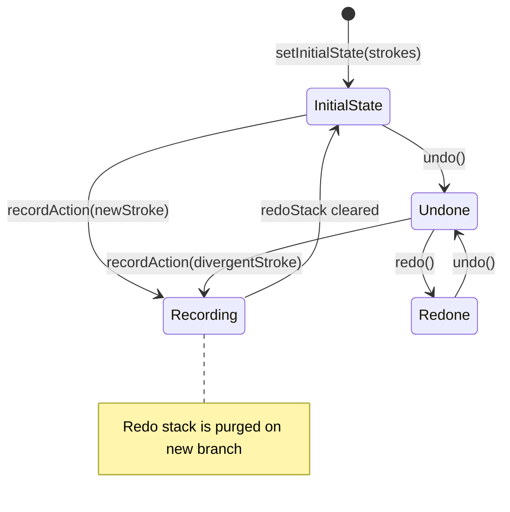

# Undo/Redo Engine & Inking History Stack

- **File Path**: [`app/src/main/kotlin/com/mal5odha/core/ink/UndoRedoManager.kt`](file:///d:/projects/mobile_projects/Notes/notes_app_native_android/app/src/main/kotlin/com/mal5odha/core/ink/UndoRedoManager.kt#L1-L81)
- **Subsystem**: Digital Inking Engine
- **Primary Class**: `com.mal5odha.core.ink.UndoRedoManager`

---

## 1. Architectural Responsibility

`UndoRedoManager` is an isolated, platform-agnostic state container responsible for maintaining temporal history for handwritten vector strokes. By strictly decoupling history management from Android `View` and UI lifecycles, the manager guarantees:
1. Deterministic undo/redo state restoration.
2. Reactive UI synchronization via Kotlin `StateFlow`.
3. Safe memory bounds during long handwriting sessions.

---

## 2. Reactive State Flow Model

The manager exposes two immutable `StateFlow` streams defined in [`UndoRedoManager.kt:15-19`](file:///d:/projects/mobile_projects/Notes/notes_app_native_android/app/src/main/kotlin/com/mal5odha/core/ink/UndoRedoManager.kt#L15-L19):

```kotlin
private val _history = MutableStateFlow<List<Stroke>>(emptyList())
val history: StateFlow<List<Stroke>> = _history.asStateFlow()

private val _redoStack = MutableStateFlow<List<Stroke>>(emptyList())
val redoStack: StateFlow<List<Stroke>> = _redoStack.asStateFlow()
```

Compose UI components (such as `UnifiedTopToolbar` and `FloatingToolbar`) observe `canUndo` and `canRedo` booleans to enable/disable toolbar icons dynamically without polling:

```kotlin
val canUndo: Boolean get() = _history.value.isNotEmpty()
val canRedo: Boolean get() = _redoStack.value.isNotEmpty()
```

---

## 3. History Mutation Transitions

The state transitions follow classic linear command history semantics with future-invalidation:



### 3.1 Recording New Inking Actions
Whenever a new stroke completes on the front buffer:
```kotlin
fun recordAction(stroke: Stroke) {
    _history.update { it + stroke }
    _redoStack.value = emptyList() // Any new action invalidates the redo future
}
```

### 3.2 Selective Deletion (Eraser & Lasso Cut)
When strokes are erased or lasso-deleted, removing them from the active list must clear the redo stack to prevent dangling references:
```kotlin
fun removeStroke(stroke: Stroke) {
    _history.update { it.filter { s -> s.id != stroke.id } }
    _redoStack.value = emptyList()
}
```

---

## 4. Multi-Page Context Isolation

In `MultiPageEditorViewModel`, each page maintains its own stroke array in memory:
$$\text{PageId} \to \text{List}\langle\text{Stroke}\rangle$$

When switching pages in the document carousel:
1. The active page's strokes are committed to the page cache.
2. `UndoRedoManager.setInitialState(targetPageStrokes)` is called.
3. The redo stack for the newly focused page resets, preventing accidental cross-page undos.
