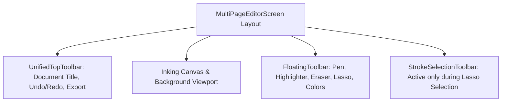

# Adaptive Toolbars & Stylus Interaction Design

- **Floating Toolbar**: [`app/src/main/kotlin/com/mal5odha/app/ui/components/FloatingToolbar.kt`](file:///d:/projects/mobile_projects/Notes/notes_app_native_android/app/src/main/kotlin/com/mal5odha/app/ui/components/FloatingToolbar.kt#L1-L120)
- **Top Toolbar**: [`app/src/main/kotlin/com/mal5odha/app/ui/components/UnifiedTopToolbar.kt`](file:///d:/projects/mobile_projects/Notes/notes_app_native_android/app/src/main/kotlin/com/mal5odha/app/ui/components/UnifiedTopToolbar.kt#L1-L90)
- **Selection Bar**: [`app/src/main/kotlin/com/mal5odha/app/ui/components/StrokeSelectionToolbar.kt`](file:///d:/projects/mobile_projects/Notes/notes_app_native_android/app/src/main/kotlin/com/mal5odha/app/ui/components/StrokeSelectionToolbar.kt#L1-L75)
- **Subsystem**: Presentation & UI Layer

---

## 1. Ergonomic Design for Tablet Stylus Users

Handwritten note-taking requires an uncluttered viewport where UI elements do not obstruct the user's resting palm or active drawing area.

Mal5odha implements a dual-toolbar architecture:
1. **Unified Top Toolbar**: Fixed chrome displaying document title, page index carousel indicator, global Undo/Redo buttons, Export options, and settings.
2. **Floating Contextual Inking Toolbar**: A movable or dockable Material 3 pill toolbar dedicated exclusively to inking instruments:
   - Tool Selectors: Pen, Highlighter, Eraser, Lasso, Text Box.
   - Quick Palette: 5 fast-switching color chips with current selection halo.
   - Stroke Width Presets: 3 calibrated thickness swatches ($2\text{dp}$, $5\text{dp}$, $12\text{dp}$).

---

## 2. Touch Target Guidelines & Stylus Precision

In compliance with Material Design 3 stylus guidelines:
- **Minimum Hit Targets**: All toolbar action icons enforce a minimum $48 \times 48\text{ dp}$ touch target bounding box to accommodate both fingertip taps and fine stylus nib clicks.
- **Visual Feedback**: Interactive elements utilize subtle elevation increases and ripple effects on hover (`Modifier.pointerInput` stylus hover detection).

---

## 3. Contextual Lasso Selection Toolbar (`StrokeSelectionToolbar`)

When the user lasso-selects a group of strokes, a contextual mini-toolbar immediately anchors above the selection's bounding box:

- **Actions**:
  - **Duplicate**: Clones the vector strokes with an offset (+20dp, +20dp).
  - **Recolor**: Applies a new color chip to all selected strokes simultaneously.
  - **Delete**: Removes strokes and records the deletion in the undo history stack.
  - **Resize / Rotate**: Toggles transform handles around the group.
