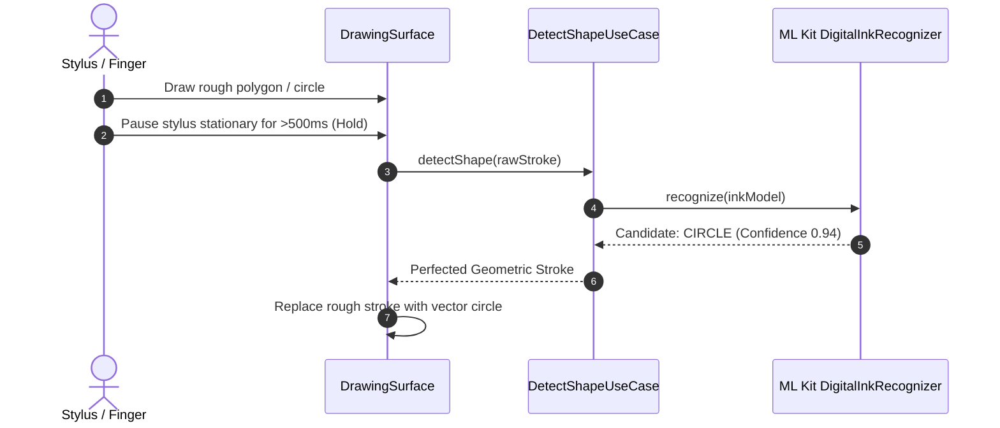

# Shape Detection & ML Kit Document Scanner

- **Shape Detection**: [`app/src/main/kotlin/com/mal5odha/core/ink/domain/DetectShapeUseCase.kt`](file:///d:/projects/mobile_projects/Notes/notes_app_native_android/app/src/main/kotlin/com/mal5odha/core/ink/domain/DetectShapeUseCase.kt#L1-L50)
- **Shape Service**: [`app/src/main/kotlin/com/mal5odha/core/ink/services/ShapeDetectionService.kt`](file:///d:/projects/mobile_projects/Notes/notes_app_native_android/app/src/main/kotlin/com/mal5odha/core/ink/services/ShapeDetectionService.kt#L1-L60)
- **Scanner ViewModel**: [`app/src/main/kotlin/com/mal5odha/app/ui/screens/ScannerViewModel.kt`](file:///d:/projects/mobile_projects/Notes/notes_app_native_android/app/src/main/kotlin/com/mal5odha/app/ui/screens/ScannerViewModel.kt#L1-L60)
- **Subsystem**: Document Intelligence & Machine Learning

---

## 1. On-Device Shape Recognition (Hold-to-Snap)

When drawing geometric figures (lines, circles, rectangles, triangles, stars, arrows), users often desire clean, straight vector outlines. Mal5odha implements an intuitive **Hold-to-Snap** gesture powered by Google ML Kit's **Digital Ink Recognition API** (`com.google.mlkit:digital-ink-recognition`):

### 1.1 Geometric Snapping Heuristics
If ML Kit is offline or model download is pending, `DetectShapeUseCase` falls back to fast trigonometric heuristics:
- **Straight Lines**: Computes the ratio of Euclidean distance $\|P_{\text{end}} - P_{\text{start}}\|$ to the cumulative path length $\sum \|P_{i+1} - P_i\|$. If the ratio is $>0.96$, snaps to a perfect line.
- **Closed Ellipses**: If start and end points are within radius $\epsilon$ and aspect ratio is balanced, calculates the optimal least-squares center and radii $(c_x, c_y, r_x, r_y)$.

---

## 2. ML Kit Document Scanner Integration

The physical scanner workflow utilizes Google Play Services' on-device **ML Kit Document Scanner** (`com.google.android.gms:play-services-mlkit-document-scanner`):

### Key Capabilities:
1. **Automatic Edge Detection**: Detects paper edges in real-time camera viewfinder frames without manual quadrilateral corner dragging.
2. **Perspective Rectification**: Applies planar homography transformation to project angled perspective shots into flat rectangular documents.
3. **Shadow & Glare Removal**: Applies adaptive image filters to normalize lighting and enhance contrast for clean background rendering.

### Output Integration:
Scanned pages are saved to the document's private directory as compressed JPEG assets and automatically appended to `UnifiedDocument.pages` as `PageBackground.IMAGE`, immediately accessible for stylus annotations.
