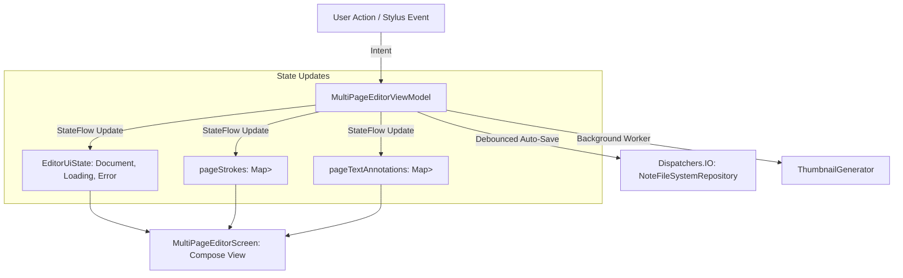

# MultiPageEditorViewModel & MVI State Orchestration

- **File Path**: [`app/src/main/kotlin/com/mal5odha/app/ui/screens/MultiPageEditorViewModel.kt`](file:///d:/projects/mobile_projects/Notes/notes_app_native_android/app/src/main/kotlin/com/mal5odha/app/ui/screens/MultiPageEditorViewModel.kt#L34-L545)
- **Subsystem**: Presentation & UI Layer
- **Primary Class**: `com.mal5odha.app.ui.screens.MultiPageEditorViewModel`

---

## 1. Architectural Role & MVI Pattern

`MultiPageEditorViewModel` acts as the single source of truth for all active note-taking operations. It follows Model-View-Intent (MVI) principles to ensure unidirectional data flow:



---

## 2. In-Memory State Partitioning

To avoid UI recomposition freezes, the ViewModel separates high-frequency stroke changes from document metadata:

```kotlin
// MultiPageEditorViewModel.kt:46-60
private val _uiState = MutableStateFlow(EditorUiState())
val uiState: StateFlow<EditorUiState> = _uiState.asStateFlow()

// Map of PageId to List of Strokes (decoupled from document metadata)
private val _pageStrokes = MutableStateFlow<Map<String, List<Stroke>>>(emptyMap())
val pageStrokes: StateFlow<Map<String, List<Stroke>>> = _pageStrokes.asStateFlow()

// Map of PageId to List of TextAnnotations
private val _pageTextAnnotations = MutableStateFlow<Map<String, List<TextAnnotation>>>(emptyMap())
val pageTextAnnotations: StateFlow<Map<String, List<TextAnnotation>>> = _pageTextAnnotations.asStateFlow()
```

### Benefits:
- Mutating a single stroke on Page 2 does **not** trigger recomposition of Page 1 or the top navigation bar.
- Only the canvas observing `pageStrokes[pageId]` invalidates its render pass.

---

## 3. Debounced Auto-Save Engine

Writing strokes to disk after every single pen movement causes severe I/O thrashing. `MultiPageEditorViewModel` implements a **debounced coroutine auto-save mechanism**:

```kotlin
private var autoSaveJob: Job? = null

fun onStrokesModified(pageId: String, strokes: List<Stroke>) {
    _pageStrokes.update { current -> current + (pageId to strokes) }

    autoSaveJob?.cancel()
    autoSaveJob = viewModelScope.launch(Dispatchers.IO) {
        delay(1500) // 1.5 second debounce window
        fileSystemRepository.savePageStrokes(documentId, pageId, strokes.map { it.toMl5Stroke() })
        generateAndPersistThumbnail()
    }
}
```

If the user continues writing, the save job is repeatedly reset. Once drawing pauses for $1.5\text{ seconds}$, the binary file is saved atomically.

---

## 4. Multi-Page Lifecycle Management

- **Page Insertion**: Generates a new `DocumentPage` UUID, inserts it into the page list at index $N+1$, and re-indexes page ordering.
- **Page Deletion**: Removes the page metadata, purges the corresponding `strokes_{pageId}.bin` file from disk, and shifts subsequent page indices.
- **Page Duplication**: Performs a deep copy of vector strokes and attaches them to a newly minted page ID.
