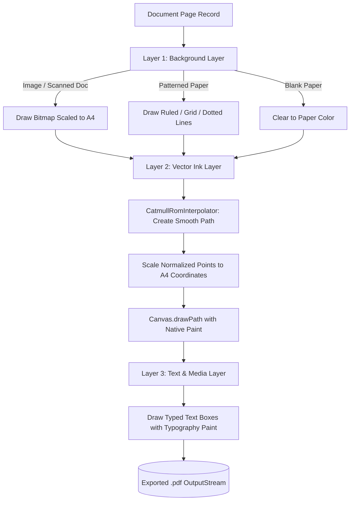

# PDF Export Engine & Vector Blending

- **File Path**: [`app/src/main/kotlin/com/mal5odha/core/pdf/PdfExportService.kt`](file:///d:/projects/mobile_projects/Notes/notes_app_native_android/app/src/main/kotlin/com/mal5odha/core/pdf/PdfExportService.kt#L20-L167)
- **Subsystem**: PDF & Document Subsystem
- **Primary Class**: `com.mal5odha.core.pdf.PdfExportService`

---

## 1. Architectural Responsibility

`PdfExportService` serializes the multi-layered state of a note (paper backgrounds, scanned images, handwritten vector strokes, and typed text boxes) into standard vector-compliant PDF files using Android's native `android.graphics.pdf.PdfDocument`.

Unlike simple raster screenshot exports (which produce blurry text and huge file sizes), this service renders vector ink paths as true native PDF vector drawing commands, preserving razor-sharp fidelity at any print or zoom resolution.

---

## 2. Multi-Layer Page Compositing Pipeline

For each page in the document, `exportToPdf()` executes a 3-layer compositing pipeline onto the PDF canvas:

---

## 3. Dimensional Standards & Coordinate Mapping

As defined in [`PdfExportService.kt:37-39`](file:///d:/projects/mobile_projects/Notes/notes_app_native_android/app/src/main/kotlin/com/mal5odha/core/pdf/PdfExportService.kt#L37-L39), exported pages adhere to the international **ISO 216 A4** standard at 72 PostScript Points Per Inch (PPI):

$$\begin{aligned}
\text{Width}_{\text{A4}} &= 595 \text{ points} \quad (8.26 \text{ inches} \times 72) \\
\text{Height}_{\text{A4}} &= 842 \text{ points} \quad (11.69 \text{ inches} \times 72)
\end{aligned}$$

Because strokes are stored in normalized page coordinates $(x_p, y_p) \in [0.0, 1.0]$, converting to print coordinates is exact:

$$\begin{aligned}
x_{\text{export}} &= x_p \cdot 595 \\
y_{\text{export}} &= y_p \cdot 842 \\
w_{\text{export}} &= w_{\text{stroke}} \cdot \left(\frac{595}{\text{referenceWidth}}\right)
\end{aligned}$$

---

## 4. Ink Tool Paint Characteristics

Different ink tools require specialized canvas blending modes:

| Ink Tool | Paint Color | Alpha / Blending | Stroke Cap / Join |
|---|---|---|---|
| **Pen** | Chosen Color | $100\%$ Opacity (`SRC_OVER`) | `Cap.ROUND`, `Join.ROUND` |
| **Highlighter** | Chosen Color | $35\%$ Opacity (`SRC_OVER`) | `Cap.SQUARE`, `Join.MITER` |
| **Calligraphy** | Chosen Color | $100\%$ Opacity | Dynamic angled polygon fill |

Highlighter strokes preserve underlying background text and ruling lines through alpha blending, matching physical highlighter behavior.

---

## 5. Coroutine Dispatching & Stream Safety

Exporting multi-page PDFs involves intensive file I/O and PDF vector encoding. The service runs on `Dispatchers.IO`:
- Uses atomic file streams (`FileOutputStream`).
- Calls `pdfDocument.finishPage()` and `pdfDocument.writeTo(outputStream)`.
- Enforces `pdfDocument.close()` inside a `finally` block to release native memory allocations.
