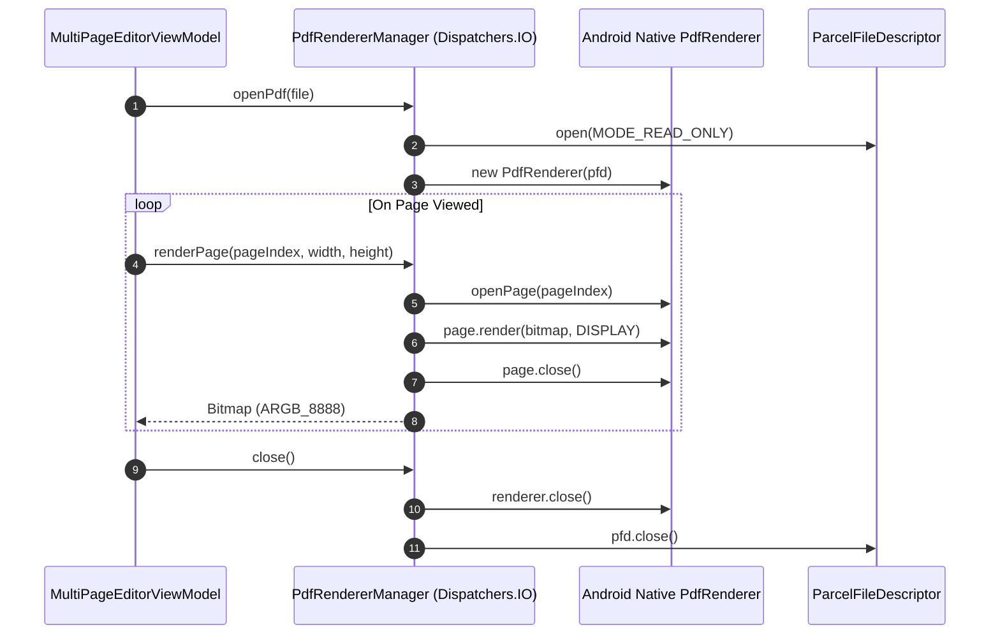

# PDF Renderer Engine & Bitmap LRU Cache

- **File Path**: [`app/src/main/kotlin/com/mal5odha/core/pdf/PdfRendererManager.kt`](file:///d:/projects/mobile_projects/Notes/notes_app_native_android/app/src/main/kotlin/com/mal5odha/core/pdf/PdfRendererManager.kt#L11-L44)
- **Secondary**: [`app/src/main/kotlin/com/mal5odha/core/pdf/PdfDocumentManager.kt`](file:///d:/projects/mobile_projects/Notes/notes_app_native_android/app/src/main/kotlin/com/mal5odha/core/pdf/PdfDocumentManager.kt#L1-L60)
- **Cache**: [`app/src/main/kotlin/com/mal5odha/core/pdf/cache/BitmapLruCache.kt`](file:///d:/projects/mobile_projects/Notes/notes_app_native_android/app/src/main/kotlin/com/mal5odha/core/pdf/cache/BitmapLruCache.kt#L13-L74)
- **Subsystem**: PDF & Document Subsystem
- **Primary Class**: `com.mal5odha.core.pdf.PdfRendererManager`

---

## 1. Architectural Challenge: High-DPI PDF Rendering on Mobile

PDF documents contain arbitrary vector and text definitions that must be rasterized to high-density bitmaps for mobile display. On modern Android tablets (e.g., $2560 \times 1600$ at 300+ DPI), a single full-resolution ARGB_8888 page bitmap consumes:

$$\text{Memory} = 2560 \times 1600 \times 4 \text{ bytes} \approx 16.38\text{ MB per page}$$

In a 50-page lecture slide or textbook document, unmanaged bitmap allocation will immediately crash the Android ART runtime with an `OutOfMemoryError` (OOM).

Furthermore, Android's native `android.graphics.pdf.PdfRenderer` requires exclusive, non-thread-safe access to its underlying native C++ engine and file descriptor.

---

## 2. Thread-Safe Lifecycle & File Descriptor Management

`PdfRendererManager` encapsulates `android.graphics.pdf.PdfRenderer` and its underlying `ParcelFileDescriptor`:

```kotlin
// PdfRendererManager.kt:16-19
suspend fun openPdf(file: File) = withContext(Dispatchers.IO) {
    fileDescriptor = ParcelFileDescriptor.open(file, ParcelFileDescriptor.MODE_READ_ONLY)
    pdfRenderer = PdfRenderer(fileDescriptor!!)
}
```

### Safety Guarantees:
1. **Dispatcher Isolation**: All calls to open pages and render bitmaps are strictly dispatched to `Dispatchers.IO` to prevent blocking the Compose UI thread.
2. **Deterministic Cleanup**: `close()` safely disposes the native `PdfRenderer` before closing the `ParcelFileDescriptor`, avoiding native SIGSEGV crashes caused by premature descriptor closure.



---

## 3. Bitmap LRU Cache Architecture

To ensure smooth 60–120 FPS page scrolling without re-rasterizing visited pages, `BitmapLruCache` maintains an in-memory Least Recently Used cache bound to **25% of the total JVM heap size**:

```kotlin
// BitmapLruCache.kt:16-23
private val maxMemory = (Runtime.getRuntime().maxMemory() / 1024).toInt()
private val cacheSize = maxMemory / 4 // Use 25% of max available memory

private val memoryCache = object : LruCache<String, Bitmap>(cacheSize) {
    override fun sizeOf(key: String, bitmap: Bitmap): Int {
        return bitmap.byteCount / 1024
    }
}
```

### 3.1 Cache Eviction Strategy
- **Key Generation**: `key = "${documentId}_page_${pageIndex}_${renderWidth}x${renderHeight}"`.
- When heap pressure approaches the 25% boundary, oldest unreferenced page bitmaps are automatically evicted.
- Synchronized locks (`synchronized(memoryCache)`) ensure concurrency safety when background pre-rendering workers compete with UI render calls.

---

## 4. Pre-Rendering & High-DPI Downsampling

When loading a PDF page:
1. The viewport size in physical pixels is queried.
2. If the user zooms in past $1.5\times$ scale, higher resolution tile segments are rendered and cached.
3. When zooming out, downsampled low-resolution thumbnails are used to minimize fill-rate pressure on the GPU.
