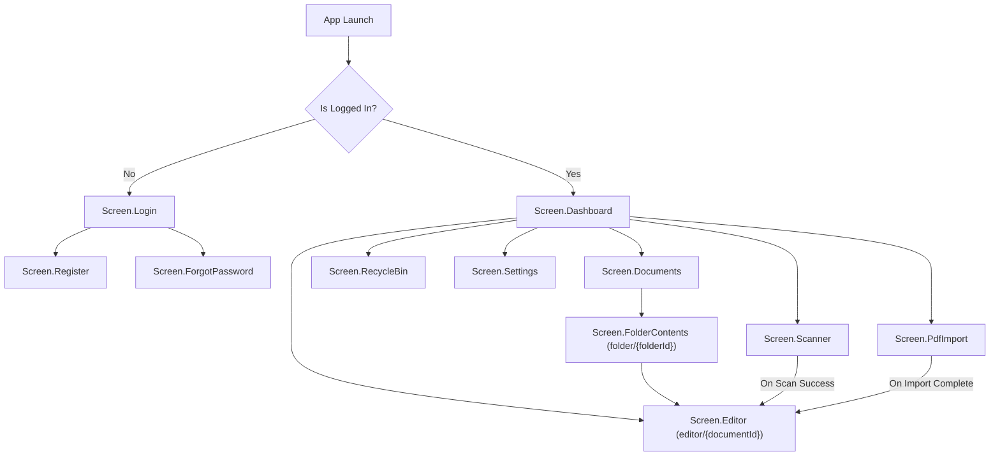

# Navigation Topology & Feature Routes

- **File Path**: [`app/src/main/kotlin/com/mal5odha/app/navigation/Screen.kt`](file:///d:/projects/mobile_projects/Notes/notes_app_native_android/app/src/main/kotlin/com/mal5odha/app/navigation/Screen.kt#L1-L40)
- **NavHost Controller**: [`app/src/main/kotlin/com/mal5odha/app/MainActivity.kt`](file:///d:/projects/mobile_projects/Notes/notes_app_native_android/app/src/main/kotlin/com/mal5odha/app/MainActivity.kt#L51-L178)

---

## 1. Single-Activity Navigation Architecture

Mal5odha follows Android's Single-Activity pattern. `MainActivity` hosts a single Jetpack Compose `NavHost` backed by `rememberNavController()`.

---

## 2. Route Directory & Parameter Specifications

| Screen Route | Parameter Pattern | Factory Helper | Destination Composable | Description |
|---|---|---|---|---|
| `dashboard` | None | `Screen.Dashboard.route` | `DashboardScreen` | Main grid of recent notes, folders, and quick actions |
| `editor/{documentId}` | `documentId: String` | `Screen.Editor.createRoute(docId)` | `MultiPageEditorScreen` | Real-time multi-page stylus inking and PDF viewer |
| `documents` | None | `Screen.Documents.route` | `DocumentsScreen` | Full file manager view with folder nesting |
| `folder/{folderId}` | `folderId: String` | `Screen.FolderContents.createRoute(id)` | `FolderContentsScreen` | Granular view of documents within a specific folder |
| `scanner` | None | `Screen.Scanner.route` | `ScannerScreen` | Camera-based physical document scanning |
| `pdf_import` | None | `Screen.PdfImport.route` | `PdfImportScreen` | SAF file picker for importing external PDF files |
| `recycle_bin` | None | `Screen.RecycleBin.route` | `RecycleBinScreen` | Soft-deleted documents recovery and permanent purge |
| `login` / `register` | None | `Screen.Login.route` | `LoginScreen` / `RegisterScreen` | User authentication & credential management |
| `settings` | None | `Screen.Settings.route` | `SettingsScreen` | Theme toggle (Dark/Light), S-Pen stylus preferences |
