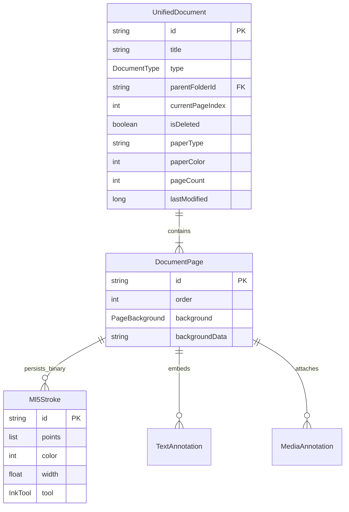

# Principal-Level Architectural Guide

- **Target Audience**: Staff, Principal, and Lead Mobile/Graphics Engineers
- **System**: Mal5odha Native Android Digital Inking & PDF Engine
- **Primary References**: 
  - [`DrawingSurface.kt:42`](file:///d:/projects/mobile_projects/Notes/notes_app_native_android/app/src/main/kotlin/com/mal5odha/core/ink/ui/DrawingSurface.kt#L42)
  - [`CatmullRomInterpolator.kt:19`](file:///d:/projects/mobile_projects/Notes/notes_app_native_android/app/src/main/kotlin/com/mal5odha/core/ink/math/CatmullRomInterpolator.kt#L19)
  - [`QuadTree.kt:11`](file:///d:/projects/mobile_projects/Notes/notes_app_native_android/app/src/main/kotlin/com/mal5odha/core/ink/spatial/QuadTree.kt#L11)
  - [`BinaryStrokeSerializer.kt:17`](file:///d:/projects/mobile_projects/Notes/notes_app_native_android/app/src/main/kotlin/com/mal5odha/core/data/serializer/BinaryStrokeSerializer.kt#L17)

---

## 1. Executive Summary & The Core Architectural Insight

High-fidelity handwriting and digital inking applications present a unique systems challenge on Android: **human proprioception detects pen-to-glass tracking latency above $15\text{ ms}$**. 

Mainstream mobile UI architectures (declarative composables, virtual DOMs, standard View hierarchies) are inherently unsuitable for high-frequency input rendering ($120\text{ Hz} - 240\text{ Hz}$) because layout calculation passes, diff algorithms, and multi-threaded compositor sync introduce non-deterministic micro-stutters.

### The Mal5odha Architectural Axiom
**Decouple the active inking hot-path completely from the UI framework, isolating stylus input into a hardware-direct front-buffered surface with normalized spatial coordinates, while anchoring metadata and UI chrome in declarative Jetpack Compose.**

```python
# Conceptual Python abstraction illustrating the core decoupled coordinate & front-buffer pipeline
class InkingPipeline:
    def __init__(self, page_bounds, spatial_index):
        self.bounds = page_bounds # (left, top, width, height)
        self.index = spatial_index
        self.front_buffer = []

    def on_stylus_event(self, screen_x: float, screen_y: float, pressure: float):
        l, t, w, h = self.bounds
        if not (l <= screen_x <= l + w and t <= screen_y <= t + h):
            return None # Touch isolation: reject touch outside page
        
        # Transform screen space to normalized page space [0.0, 1.0]
        norm_x = (screen_x - l) / w
        norm_y = (screen_y - t) / h
        point = (norm_x, norm_y, pressure)
        
        # Render directly to front-buffer without waiting for frame compositor
        self.front_buffer.append(point)
        return point
```

---

## 2. End-to-End System Architecture

```mermaid
graph TD
    subgraph Input & Low-Latency Hardware Layer
        Stylus[Active Stylus / Digitizer S-Pen] --> Predictor[MotionEventPredictor]
        Predictor --> Surface[DrawingSurface: SurfaceView]
        Surface --> FrontBuf[CanvasFrontBufferedRenderer: Low-Latency Front Buffer]
    end

    subgraph Mathematical Geometry & Spatial Indexing
        Surface --> Spline[CatmullRomInterpolator: Centripetal Splines Alpha=0.5]
        Surface --> QuadTree[QuadTree 2D Spatial Index: O log N]
        Surface --> VPort[ViewportState: Screen <-> Page Affine Matrices]
    end

    subgraph Presentation & UI Layer (Jetpack Compose)
        EditorScreen[MultiPageEditorScreen] --> TopBar[UnifiedTopToolbar]
        EditorScreen --> FloatBar[FloatingToolbar & StrokeSelectionToolbar]
        EditorScreen --> VM[MultiPageEditorViewModel: MVI Pattern]
    end

    subgraph Data & Storage Subsystem
        VM --> RoomDB[(Room SQLite DB: DocumentDao)]
        VM --> Repo[NoteFileSystemRepositoryImpl]
        Repo --> BinSer[BinaryStrokeSerializer: Magic 0x4D4C3553]
        Repo --> DiskStorage[("/files/notes/{docId}/strokes_{pageId}.bin")]
    end

    subgraph PDF Rasterization Subsystem
        VM --> PdfMgr[PdfRendererManager: Dispatchers.IO]
        PdfMgr --> Lru[BitmapLruCache: 25 Percent JVM Heap]
        PdfMgr --> PdfNative[Android Native PdfRenderer]
    end

    FrontBuf -.->|Commit on ACTION_UP| Surface
    Surface -->|Update Stroke Vectors| VM
    VPort -.->|Matrix Inverse| Surface
```

---

## 3. Domain Model Architecture (ERD)



---

## 4. Architectural Tradeoffs & Strategic Decisions

1. **Custom Binary Stroke Serialization vs Protocol Buffers / FlatBuffers**:
   - *Decision*: A hand-rolled binary format (`BinaryStrokeSerializer.kt:17`) with a 4-byte magic header (`0x4D4C3553`).
   - *Rationale*: Avoids heavy runtime code-generation libraries while maximizing memory-packing density (20 bytes per point vs 60+ bytes for JSON).
2. **SurfaceView Interop vs Pure Compose Graphics**:
   - *Decision*: Host a native Android `SurfaceView` inside an `AndroidView` composable wrapper.
   - *Rationale*: Allows hardware-accelerated dual-buffering (`CanvasFrontBufferedRenderer`) unavailable in pure Compose canvases.
3. **QuadTree vs R-Tree / Grid Partitioning**:
   - *Decision*: 2D QuadTree with max depth 6 and leaf capacity 8.
   - *Rationale*: Simpler deterministic memory footprint and sub-millisecond range hit-tests during eraser drag.

---

## 5. Staff/Principal Engineer Reading Order

1. [`DrawingSurface.kt`](file:///d:/projects/mobile_projects/Notes/notes_app_native_android/app/src/main/kotlin/com/mal5odha/core/ink/ui/DrawingSurface.kt#L42): Understand the front-buffered vs multi-buffered rendering loop.
2. [`CatmullRomInterpolator.kt`](file:///d:/projects/mobile_projects/Notes/notes_app_native_android/app/src/main/kotlin/com/mal5odha/core/ink/math/CatmullRomInterpolator.kt#L19): Understand the centripetal Bézier control point conversion and anti-spike clamping.
3. [`QuadTree.kt`](file:///d:/projects/mobile_projects/Notes/notes_app_native_android/app/src/main/kotlin/com/mal5odha/core/ink/spatial/QuadTree.kt#L11): Examine spatial indexing and bounding box intersection logic.
4. [`ViewportState.kt`](file:///d:/projects/mobile_projects/Notes/notes_app_native_android/app/src/main/kotlin/com/mal5odha/core/pdf/viewport/ViewportState.kt#L15): Inspect affine matrix synchronization.
5. [`BinaryStrokeSerializer.kt`](file:///d:/projects/mobile_projects/Notes/notes_app_native_android/app/src/main/kotlin/com/mal5odha/core/data/serializer/BinaryStrokeSerializer.kt#L17): Review the on-disk binary protocol.
6. [`MultiPageEditorViewModel.kt`](file:///d:/projects/mobile_projects/Notes/notes_app_native_android/app/src/main/kotlin/com/mal5odha/app/ui/screens/MultiPageEditorViewModel.kt#L34): Follow the MVI reactive event flow.
